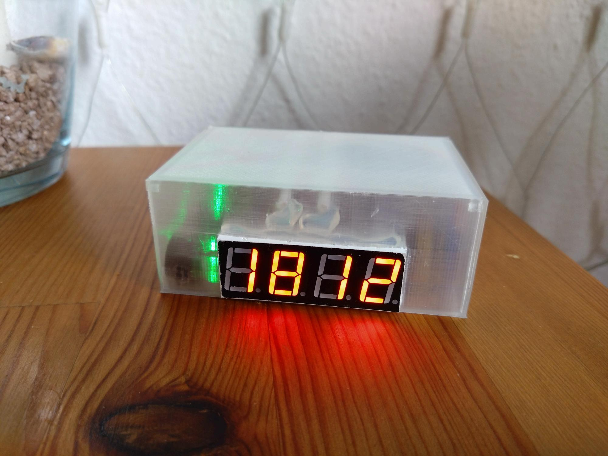

# Quack_Quack_Watch
Nord german version of cuckoo clock builded with an Arduino Nano, DCF receiver and 3D prints.

## Project description
This project aims to build a clock that uses AM radio waves to mantain a accurate timing on an Arduino Nano board and then add some functionality like simulating the quack of a duck with a passive buzzer and some servo motor to move the cuckoo "in this case is a duck ;-)" 

## Requirements
### Hardware
    - Arduino Nano
    - DCF receiver
    - 4 digit 7 segment display
    - servo motor 9g SG90
    - 100 microFarrad capacitor
    - passive Buzzer
    - 1 Resistor (10k Ohm)
    - 8 Resistors (220 Ohm)
    - wires (M-M, F-M, F-F)
    - 3D Printer (optional)

### Software
    - Arduino IDE
    - Slicer (optional)

## Documentation
Diagramms ... follows....
### Arduino nano 
The following table contains a list of interfaces that goes connected to the Arduino board.
| Sensor/Aktor | Pin | Pin on Arduino| Pin on 4 Digit|
|--------------|-----|---------------|---------------|
|    Buzzer    | +   |      12       |        x      |
| Servo motor  | Signal |   11       |        x      |
|DCF           |+    |      3.3V     |        x      |
|DCF           |Signal |      2      |        x      |
|DCF           |GND    |      GND    |        x      |
| 74HC595      | VCC |      5v       |        x      |
| 74HC595      | QA |        x       |        11     |
| 74HC595      | SER |       D3      |        x      |
| 74HC595      | OE |        GND     |        x      |
| 74HC595      | RCLK |      D4      |        x      |
| 74HC595      | SRCLK |    D5       |        x      |
| 74HC595      | SRCLR |    5v       |        x      |
| 74HC595      | QH' |        x      |        x      |
| 74HC595      | QB |         x      |        6      |
| 74HC595      | QC |         x      |        4      |
| 74HC595      | QD |         x      |        2      |
| 74HC595      | QE |         x      |        1      |
| 74HC595      | QF |         x      |        10     |
| 74HC595      | QG |         x      |        5      |
| 74HC595      | QH |         x      |        3      |
| 74HC595      | Ground |    GND     |        x      |
|  4 Digit 7seg  | 1 |        x      |        x      |
|  4 Digit 7seg  | 2 |        x      |        x      |
|  4 Digit 7seg  | 3 |        x      |        x      |
|  4 Digit 7seg  | 4 |        x      |        x      |
|  4 Digit 7seg  | 5 |        x      |        x      |
|  4 Digit 7seg  | 6 |       D9      |        x      |
|  4 Digit 7seg  | 7 |        x      |        x      |
|  4 Digit 7seg  | 8 |       D8      |        x      |
|  4 Digit 7seg  | 9 |       D7      |        x      |
|  4 Digit 7seg | 10 |        x      |        x      |         
|  4 Digit 7seg | 11 |        x      |        x      |
|  4 Digit 7seg | 12 |       D6      |        x      |

### DCF77 modul
Important connection details:
When using the modul from ELV the signal output isn't connected directly to arduino, instead it's connected to a Pull-Up Resistor with 10kOhm and it's configured as inverted. 

References used for information gathering and entrypoint to develop this project could be found in the following links.
 - Physikalisch-Technische Bundesanstalt => https://www.ptb.de/cms/en/ptb/fachabteilungen/abt4/fb-44/ag-442/dissemination-of-legal-time/dcf77.html
 - DCF77 Repo => https://github.com/thijse/Arduino-DCF77
 - Scheme connection => https://netcoast.ch/DCF77/DCF77.html
 - Receiver modul used was ELV DCF-2

## 3D Models
In the **"3d"** folder is a STL object ready to sclice and print. Any new modification of the 3d model can be found on my page => https://www.thingiverse.com/thing:6643637 
The professor duck 3D model comes from this repo =>  https://www.thingiverse.com/thing:1115584

## Media and related data
Photos related to project could be found inside **"media"** folder

_Dedicated to Daniel Kuon_